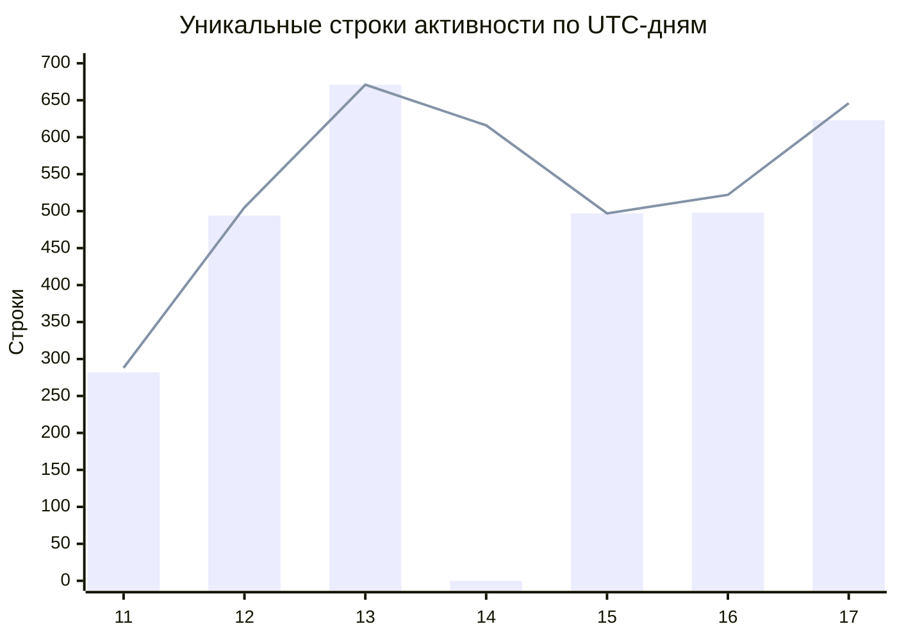
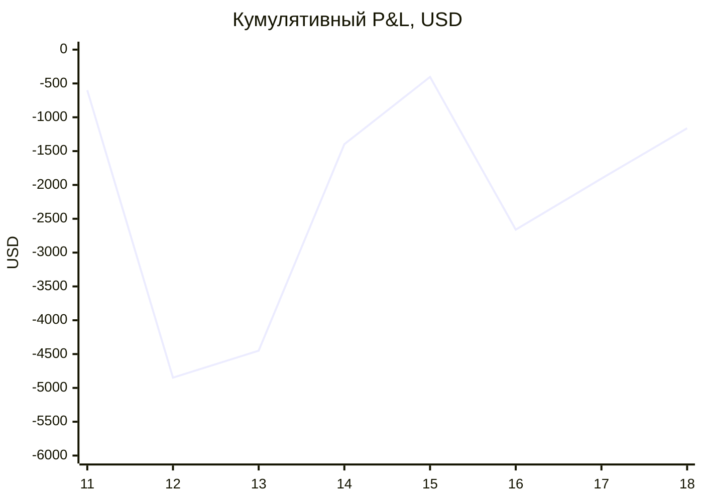
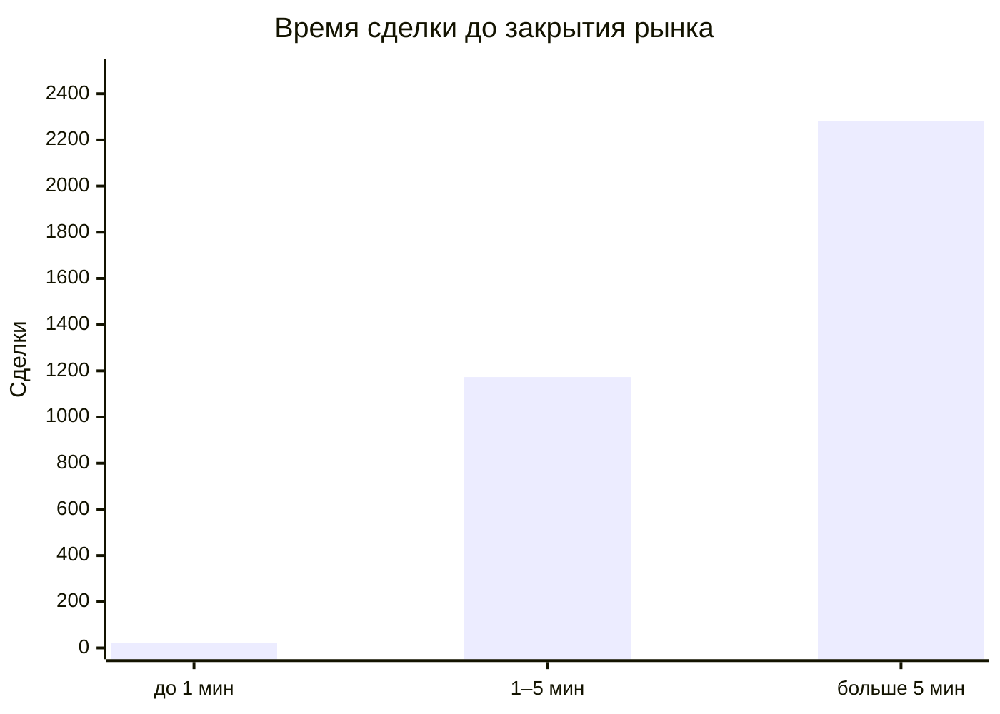

# Отчет по анализу копитрейд-стратегии

## 1. С чего начал и что нашел

Сначала я посмотрел, что лежит в `wallet_activity.parquet` и за какие даты
есть данные. В файле было 6 130 строк, но уникальных оказалось только 3 065.
Убрал точные дубли через `SELECT DISTINCT *`.

Потом проверил даты и нашел вторую проблему: полностью отсутствовал день
**14 июня 2026 года по UTC**. Я заново запросил его через Polymarket Data API
и получил 616 записей. Чтобы заодно проверить остальные дни, заново загрузил
весь период кусками по шесть часов. Новые записи добавил к исходным и еще раз
убрал дубли. Исправленный файл сохранил в
`data/wallet_activity_fixed.parquet`.

Данные Polymarket API при повторной загрузке могут отличаться, поэтому после
восстановления я зафиксировал полученный файл `wallet_activity_fixed.parquet`.
При объединении строки дедуплицировал по полям события, не включая `usdcSize`:
API иногда возвращает одно значение с разным представлением последнего знака
float.

Столбцы — исходные данные, линия — восстановленные.

Итог восстановленного файла:
- строк: **3 745**;
- сделок `TRADE`: **3 477**;
- уникальных рынков среди сделок: **444**.

## 2. Как устроена симуляция

Копируются только покупки (`BUY`) с тем же размером позиции, что у кошелька.
По условию заявка приходит через одну секунду после его сделки.
На этот момент беру последний доступный снапшот того же стакана перед исполнением копии.

Покупка идет по asks от самой низкой цены к более высокой. Так в расчет
попадает проскальзывание. Если в стакане не хватает объема, исполняется только
доступная часть.

В реальном копитрейдинге можно добавить выставление maker ордера для избежания комиссии. Реализовать расчет выгоды относительно taker ордера и проверить это на дистанции (возможно, ордера не будут заполняться в связи с высокой волатильностью и будет выгоднее оставить только maker логику). Добавить отмену maker ордера по истечении 2-3 секунд и покупку market заявкой в случае, если это будет выгоднее, нужен дополнительный бектест.

Комиссия каждого исполнения считается по формуле для crypto taker:

`fee = shares × 0,07 × price × (1 − price)`.

Результат округляется до `0,00001`. Maker rebates не
учитываю, потому что копирующая заявка забирает готовые asks и считается
taker. Еще одно упрощение: после покупки стакан не меняется. Поэтому
несколько близких сделок могут использовать одну и ту же ликвидность.

Если купленная share выиграла, каждая исполненная share приносит 1 USDC. Если
проиграла — выплата равна нулю:

- `P&L до комиссий = выплата − стоимость покупки`;
- `P&L после комиссий = P&L до комиссий − комиссии`;
- `ROI = P&L после комиссий / (стоимость покупки + комиссии)`.

Результат основного сценария с задержкой в одну секунду:

| Показатель | Результат |
|---|---:|
| P&L до комиссий | **$2 311,17** |
| Комиссии | **$3 473,68** |
| P&L после комиссий | **−$1 162,50** |
| ROI | **−0,57%** |

| День резолва | P&L после комиссий |
|---|---:|
| 11 июня | ↓ −$600,01 |
| 12 июня | ↓ −$4 248,28 |
| 13 июня | ↑ $398,34 |
| 14 июня | ↑ $3 051,91 |
| 15 июня | ↑ $994,15 |
| 16 июня | ↓ −$2 256,67 |
| 17 июня | ↑ $754,04 |
| 18 июня | ↑ $744,02 |

У стратегии будет другой результат в сравнении с кошельком. Мы
видим сделку позже, поэтому цена и глубина стакана уже могут измениться. Из-за
этого появляются проскальзывание и частичные исполнения. Кошелек мог стоять в
стакане как maker и получать rebate, а копитрейдинг заявка сразу съедает ликвидность в стакане
и платит taker комиссию.

## 3. Проверка результатов через Chainlink

Для каждого рынка беру цену BTC в момент начала и
в момент закрытия. Если конечная цена не ниже начальной, ожидаю `Up`. Если
ниже — `Down`. После этого сравниваю результат с `winning_outcome`.

Обе нужные цены нашлись у **423 из 444 рынков (95,27%)**. Все они совпали:
**423 из 423, или 100%**. У 11 рынков нет начальной цены, у 11 — конечной;
один рынок входит в обе группы. Последняя цена в файле находится за 10 секунд
до последнего `end_ts_ms`. Эти 21 рынок не учитываю ни в совпадениях, ни в
ошибках.

По проверенной части `market_outcomes.parquet` полностью совпадает с
Chainlink.

## 4. Как торгует кошелек

Кошелек торгует только 15-минутными рынками Bitcoin Up/Down. Все 3 477 сделок
— покупки, продаж нет. После резолва есть 262 операции `REDEEM`.

В каждом рынке кошелек выбирает только одну сторону: Up в 345 рынках и Down
в 99. Обычно он набирает позицию частями. В среднем получается 7,83 покупки
на рынок, медиана — 7. Минимум была 1 покупка, максимум — 34.

Медианное время сделки — за **446 секунд** до закрытия.
Среднее — за **463,09 секунды**. Распределение выглядит так:

Средняя цена купленного Up-токена — 0,5963, медианная — 0,67. Для Down —
0,6246 и 0,72. Для 3 324 сделок получилось найти цену Chainlink на секунде
входа.

Чтобы определить текущее направление BTC, я сравнил цену Chainlink в начале
рынка с ценой в секунду сделки. Если цена стала выше или была равна threshold резолва,
направлением считался `Up`, если ниже — `Down`. Затем это направление
сравнивалось с share, которую купил кошелек. Совпадение получилось в 2 301
из 3 324 сделок, или в 69,22% случаев.

Это похоже на торговлю по тренду: кошелек чаще берет сторону,
которая уже стала фаворитом, и набирает ее несколькими ордерами. Сделки идут
регулярно по всем 444 рынкам, иногда несколько раз в одну секунду. Торговля, вероятнее всего, автоматизирована (если это не заранее выставленные ордера).

## 5. Опциональная задержка CLOB → blockchain

В истории стакана есть `market`, `asset_id`, `timestamp` и `hash`. Поля
`market` и `asset_id` помогают найти снапшоты нужного токена на нужном рынке:
они соответствуют `conditionId` и `asset` из активности кошелька.

Но `hash` — это хеш состояния стакана, а не хеш blockchain-транзакции. Его
нельзя связать с `transactionHash` из `wallet_activity.parquet`.

Приближенную задержку можно попробовать посчитать как разницу между
`wallet_activity.timestamp` и ближайшим предыдущим изменением
`last_trade_price` для тех же рынка, токена и цены. Но по этой цене могли
торговать другие участники, а timestamp снапшота показывает время обновления
стакана, а не точное время сделки кошелька.
Для точного расчета нужен CLOB trade ID с временем
матчинга и его связь с `transactionHash`.

## 6. ИИ

Использовал Codex 5.5 с изменением настроек reasoning в зависимости сложности задачи.
ИИ помогал в обсуждении вариантов реализации, анализе данных, написании кода и создании графиков в отчете. Я больше выступал в роли ревьюера, валидатора логики и критика предложенных подходов.

## 7. Финальный вывод

В текущем виде идея копитрейдинга **не выглядит рабочей**. За семь дней
основной сценарий потерял **$1 162,50** после комиссий. ROI составил
**−0,57%**.

Начальный депозит рассчитан как минимальная сумма, которой хватает исполнить
все сделки без пополнений. Максимальная просадка считается от
этого депозита по рынкам в порядке их закрытия. Необходимый начальный депозит
получился **$6 641,77**, максимальная просадка — **$6 613,56**, или
**99,58% от начального депозита**.

На реальных деньгах запускать такую стратегию будет ошибкой.
